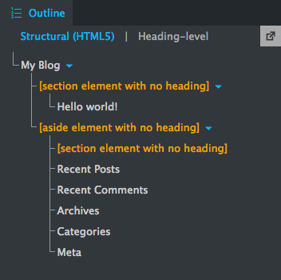
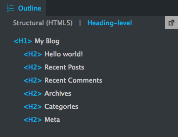
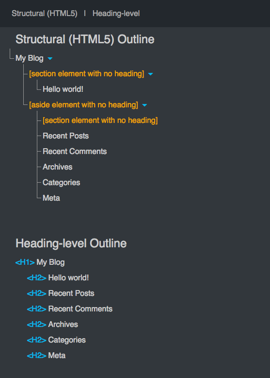

# WP HTML5 Outliner 

[WP HTML5 Outliner](https://wordpress.org/plugins/wp-html5-outliner/) (WPH5O) adds an HTML 5 outline plus a heading-level outline to the WordPress Toolbar.

## Requirements
- WordPress 3.3 or higher
- PHP 5.4.5 or higher

## Features
- Mimics the outlines provided by the [W3C Markup Validation Service](https://validator.w3.org/#validate_by_uri+with_options). *Caveat*: In an HTML 5 outline, the W3C validator may hide some of the headings in an `<hgroup>` if any of them are empty. WPH5O will not. This difference is presentational, not structural.
- Adds an ‘HTML5 Outliner’ node to the Toolbar. Outlines are displayed in a dropdown box, with the option to view them in a new browser window.
- Works only on pages or posts the user can edit. Administrators can access the outliner on any page or post. Administration Screens are not outlined.

## Screenshots
Screenshots #1 and #2 show the 'HTML5 Outliner' dropdown box in the Toolbar. At the top of the dropdown, clicking 'Structural (HTML5)' or 'Heading-level' selects the outline to display. Clicking the icon in the top right corner opens a new window that displays both outlines, as shown in screenshot #3. An HTML 5 outline appears in #1, a heading-level outline in #2.

1.  &nbsp;&nbsp;&nbsp; 2.  &nbsp;&nbsp;&nbsp; 3. 

## FAQ

### What is an HTML 5 outline?

An HTML 5 Outline represents the sections of an HTML document. Each section corresponds to an element from one of three categories:

 - *Sectioning root*: `<blockquote>`, `<body>`, `
`, `<dialog>`, `<fieldset>`, `<figure>`, `<td>`
 - *Sectioning content*: `<article>`, `<aside>`, `<nav>`, `<section>`
 - *Heading content*: `<h1>`, `<h2>`, `<h3>`, `<h4>`, `<h5>`, `<h6>`

Sections may be nested to create subsections.

Source: [W3C HTML 5.2 Specification](https://www.w3.org/TR/html52/sections.html)

### What is a heading-level outline?
A heading-level outline also represents the sections of an HTML document, but the sections correspond to heading elements only. Sections may still be nested to create subsections.

Sources: [W3C Quality Assurance](https://www.w3.org/QA/Tips/headings), [W3C HTML 5.2 Specification](https://www.w3.org/TR/html52/sections.html)

### Why do these outlines matter?
Each outline shows how well a page meets web standards for marking up document structure. User agents, particularly screen readers, use the heading-level outline to aid navigation. However, no web browsers or assistive technologies make use of the HTML 5 outline. So, really, the question is this: Why does *that* outline matter?

Although user agents still haven’t implemented the HTML 5 outline (which is about a decade old), developers aren’t giving up on it. And they have their reasons. The MDN web docs highlight some [problems solved by HTML 5 document structure](https://developer.mozilla.org/en-US/docs/Web/Guide/HTML/Using_HTML_sections_and_outlines#Problems_solved_by_HTML5).

Sources: [W3C Web Accessibility Initiative](https://www.w3.org/WAI/tutorials/page-structure/headings/), [W3C HTML 5.2 Specification](https://www.w3.org/TR/html52/sections.html)

## License

[GNU GPL-2.0 or later](http://www.gnu.org/licenses/gpl-2.0.html)

## Contributors

[Ryan S. Born](https://github.com/ryansborn)

## Acknowledgments

- Hat tip to @dominykas. The source for [h5o-js](https://github.com/h5o/h5o-js) kickstarted my implementation of the HTML 5 outline algorithm in PHP.
